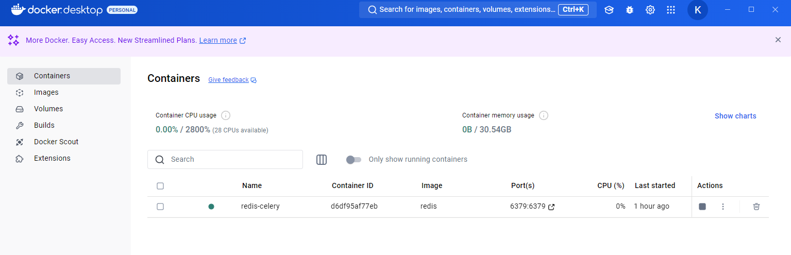
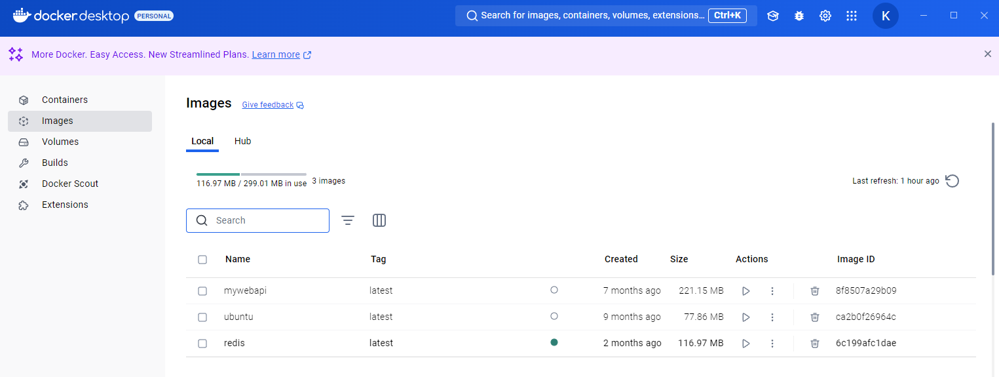
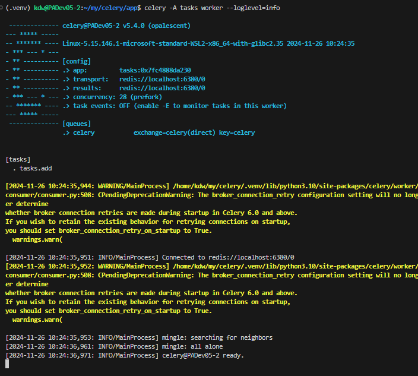
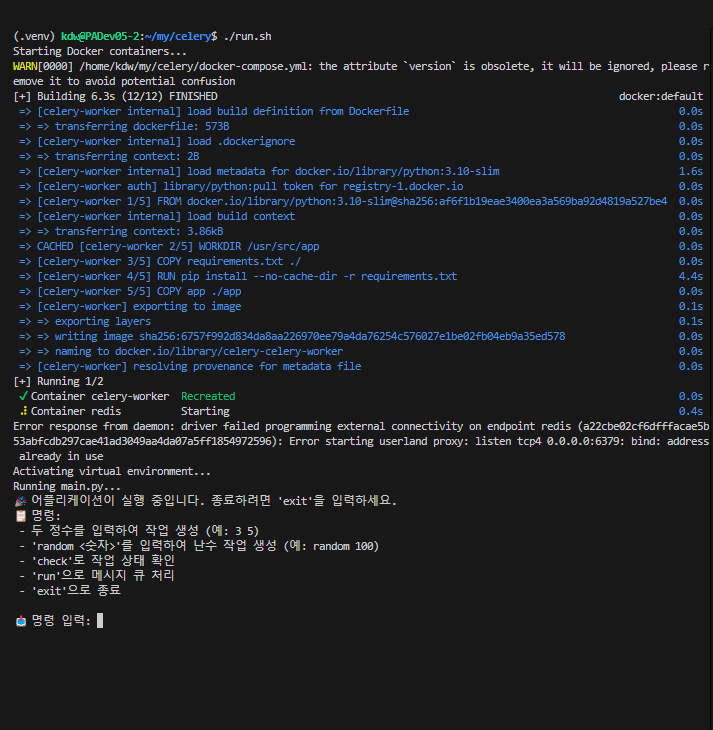
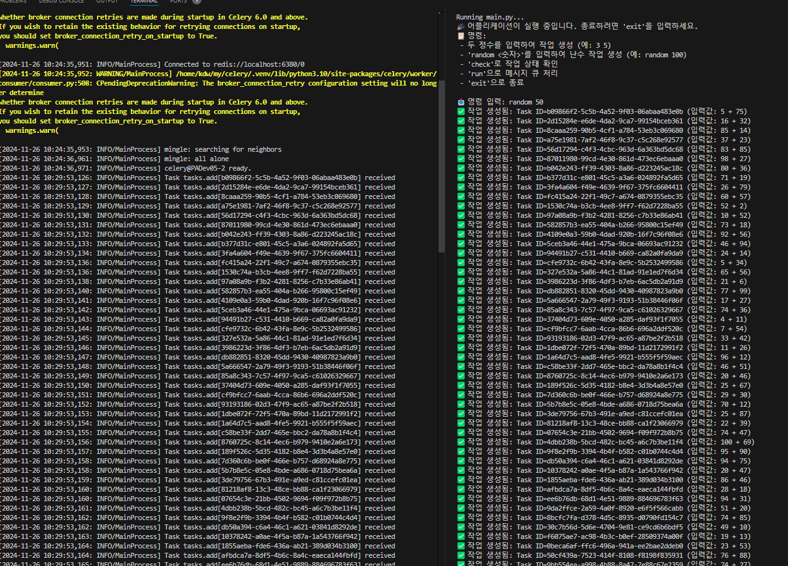
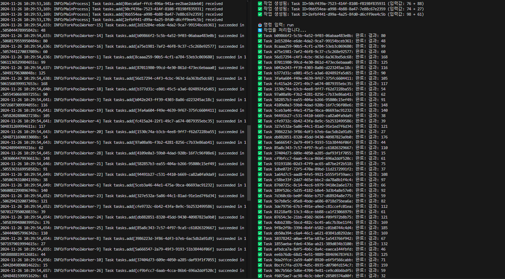

# ⚠️주의사항

* **window 환경에서는 실행 제한이 있음(WSL2 환경에서 테스트)**
    * Celery가 windows에서 `prefork` 실행 방식을 사용할 때 발생하는 멀티프로세싱 이슈
    * Celery의 기본 프로세스 풀 방식 : `prefork` ➡️ 부모 프로세스가 작업 프로세스(worker)를 여러개 생성하고 이를 통해 병렬처리 진행<br>
      Windows 멀티 프로세싱 : `spawn`<br>
      Unix/Linux 멀티 프로세싱 : `fork`<br>
    * 위의 개념에 대해서 숙지 필요


# 개요


## 1. Docker Desktop 및 WSL2 설정
```bash
wsl --list --verbose

# 설정 안되어있으면 wsl2를 기본 버전으로 설정
wsl --set-default-version 2

# docker 커맨드 실행
docker run -d --name redis-celery -p 6379:6379 redis
```
<br/><br/>

## 2. Docker Image 및 Conatiner 생성




Docker 커맨드 라인으로 Redis 연결 테스트
```bash
docker exec -it redis-celery redis-cli

# 접속하면 다음과 같은 프롬프트 표시
127.0.0.1:6379 > PING

# 응답 오면 성공
> PONG
```
<br/><br/>


## 3. Python 앱 이동

### 1. redis 패키지 설치</br>
```bash
pip install redis
```


### 2. redis 서버 연결 테스트
```python
# redis_test.py
import redis

# 실행중인 redis Docker Image에 연결해서 read/write 실행 예제

# redis 연결
r = redis.Redis(host='localhost', port=6379, db=0)

# 테스트 Key-Value 설정
r.set('test_key', 'Hello, Redis!')

value = r.get('test_key')
print(value.decode('utf-8'))
```

### 3. tasks 작성 및 등록
```python
from celery import Celery

# Celery Application 설정
app = Celery('tasks', 
             broker='redis://localhost:6379/0',
             backend='redis://localhost:6379/0')

# Annotation 이용한 작업 정의
@app.task
def add(x, y):
    return x + y
```

### 4. main.py 작성 & 실행
1. Celery의 `add` 작업을 비동기로 실행하고, 작업 ID와 상태를 출력
2. 작업 결과가 준비될 때까지 1초 간격으로 대기
3. 작업이 완료되면 결과를 출력
```python
from tasks import add
import time

# 작업을 비동기로 실행
result = add.delay(4, 6)

# 작업 결과 확인
print("Task ID:", result.id)
print("Result Ready?", result.ready())

while not result.ready():
    print("Task is not ready yet, waiting...")
    time.sleep(1)

print("Result :", result.get())
```


### 5. 작업 등록 및 main에서 작업 실행 반환 대기
```bash
celery -A tasks worker --loglevel=info

# Windows 환경에서 싱글 프로세스로 실행 (Windows는 멀티프로세싱 지원이 제한됨)
celery -A tasks worker --loglevel=info --pool=solo
```


# 실행
```bash
# 실행 권한 부여(최초에만)
chmod +x run.sh

./run.sh
```


---
# 실행 결과

### 1. celery 명령어로 task 등록
a. `celery -A tasks worker --loglevel=info` 명령어로 `tasks.py`에 정의된 Celery 작업을 워커로 등록.  
b. Celery worker는 Redis와 연결되어 메시지 큐에 작업이 들어올 때 이를 처리 대기 상태로 준비.  
c. 출력된 메시지에서 Worker가 정상적으로 실행된 것을 확인할 수 있음.



### 2. 작업 등록 후 Shell script 실행
</br>
a. `run.sh` 파일을 통해 Docker Compose로 Redis 및 Celery 워커 컨테이너 실행 후 가상환경 활성화 및 
`main.py` 실행. 이 과정에서 등록된 패키지도 동시에 설치(requirements.txt)  
b. `main.py`는 사용자 입력을 기다리며, 명령어에 따라 작업 생성 및 확인을 수행.  
c. `main.py` 실행  
정상: Shell Script가 예상대로 Redis와 Celery 환경을 설정하고 실행.


### 3. Random 명령어로 Task 생성
a. `random <숫자>` 명령어로 메시지 큐에 대량의 작업(Task)을 생성.  
b. 작업 생성 후 Task ID와 함께 입력된 값이 확인되며, 메시지 큐에 작업이 정상적으로 추가됨.  
c. 확인 결과, Redis 메시지 큐에 작업이 정상적으로 저장됨.

50개의 난수 작업이 생성되어 redis 메시지 큐에 등록된 모습

### 4. Run 명령어로 Celery Worker 실행
a. `run` 명령어를 통해 Redis 메시지 큐에 들어있는 작업을 순차적으로 처리.  
b. Celery Worker는 Redis 큐에 있는 작업을 비동기적으로 처리하며 결과를 반환.  
c. 출력 결과로 각 Task ID와 처리 결과(계산 결과)가 정상적으로 출력됨.  
정상: Celery Worker가 Redis 메시지 큐에 있는 작업을 처리.

